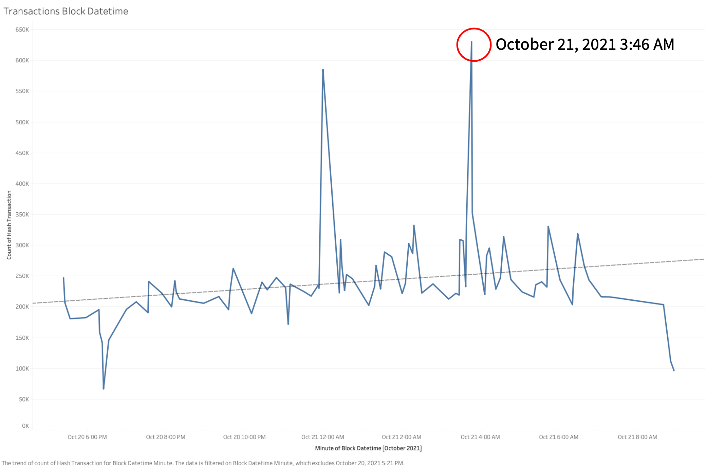
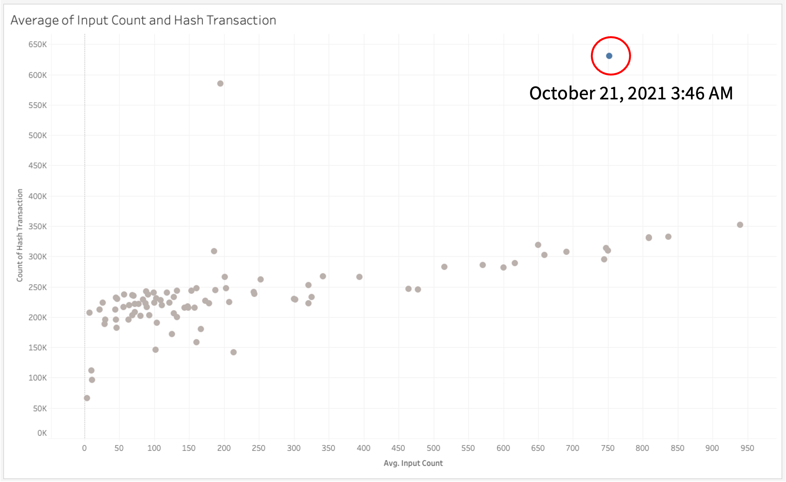
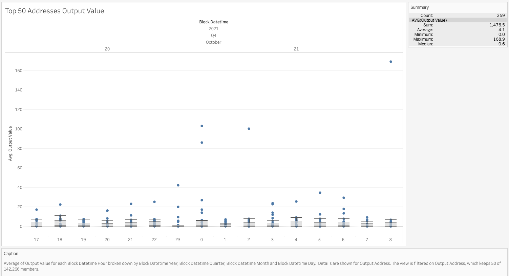
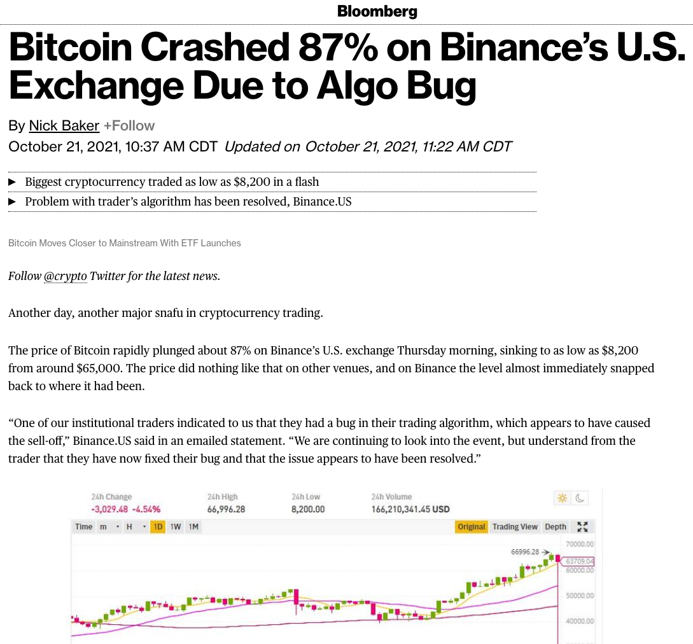

# Processing and Analysis of Binary Blocks from Bitcoin Blockchain Transactions Utilizing Python, Impala, and Tableau

This project provides a framework and code samples to parse bitcoin blockchain raw transactional data and analyze it using big data infrastructure Impala (Hadoop). The framework outlined in this project aims to help deepen the understanding of cryptocurrencies infrastructure, particularly bitcoin blockchain infrastructure that professionals in a variety of fields may find helpful. The analytical findings of this project give helpful statistics that can potentially be used for trading purposes when paired with other trading techniques. 

## Data Description

This project analyzes 90 days of bitcoin raw blockchain transactions data. The data was extracted from raw binary files that are part of a bitcoin core wallet. These are publicly available blockchain transactions to those with bitcoin wallets that are part of the greater blockchain that bitcoin is built on. This project uses Bitcoin Core. Given the number of transactions that each block of raw data contains, this paper will analyze only 90 days of raw transactional data. The 90 days are split into blocks, and each block file (of which there are 263) are approximately 128Mb (which means the complete dataset is ~34GB), for this project only use a fraction of the binary files (33) that were transformed to from binary to json format during that process the file size increased substantially from ~128Mb to ~1.1Gb, this was expected given the nature of the data. While blockchain transactional data has some structure, there is no consistency of where one transaction ends and another begins. Given the nature of the blockchain and how transaction is validated by peers, there are other factors that come into play for each transaction, making the data highly unstructured. Each of the 33 files analyzed in this project have a total of 21,156,300 million records and 29 features. The data was collected in the 90 days immediately preceding December 6, 2021. In order to collect the data for this project, bitcoin core wallet has been utilized and running 24/7 in order to collect the data. In this paper, we will not be discussing the intricacies and different features around raw bitcoin transactions, but a link to a sample of raw blockchain transaction data is available in the appendix.

## Problem Statement

At this time, the terms bitcoin and blockchain have become part of the daily finance and trading lexicon. Laypeople are interested in and attracted to cryptocurrencies and the derivative products that have arisen since its inception (such as NFTS (nonfungible tokens) and other blockchain-based networks). While the adoption and interest is high, understanding and analyzing the underlying structure of the bitcoin blockchain and blockchains in general is not a straightforward task given the size of the data, the frequency, and the complexities. This project aims to provide a code to parse raw blockchain transactions from unstructured data to a structured json file for further analysis, and by analyzing raw transactional data, this project aims to identify patterns such as accounts that move large volumes, spikes in volatility, and in general, have an underlying insight of the bitcoin market. 

By gathering useful statistics such as average block size, average number of transactions per block, average payments per block, and other statistics, we will be able to gain insights into price movements and gather market signals. Research questions include can we create a base code to parse raw bitcoin transaction data that can then be utilized with big data infrastructure such as Hadoop and Impala to analyze the bitcoin blockchain, and while analyzing the bitcoin blockchain transactions, can we generate useful statistics and gather market signals that can potentially be used for trading purposes?

## References

* Baker, N. (2021, October 21). Bitcoin Crashed 87% on Binance’s U.S. Exchange Due to Algo Bug. Bloomberg.com. https://www.bloomberg.com/news/articles/2021-10-21/bitcoin-appears-to-crash-87-on-binance-in-apparent-mistake#xj4y7vzkg

* Processing and Analysis of Binary Blocks from Bitcoin Blockchain Transactions Utilizing Python, Impala, and Tableau

* How Does Bitcoin Work? (n.d.). https://learnmeabitcoin.com/

* Transactions — Bitcoin. (n.d.). https://developer.bitcoin.org/reference/transactions.html

